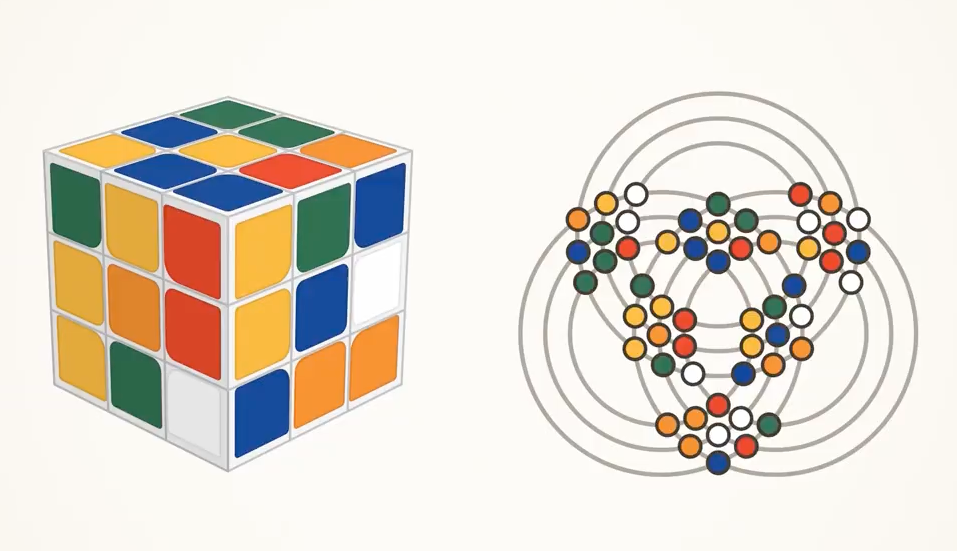

# 3x3 魔方的数学投影

[English](README.md) | [简体中文](README.zh-CN.md)

网页交互式复现原视频[*3x3 魔方的数学投影* (Mathematical projection of a 3x3 Rubik's Cube)](Mathematical%20projection%20of%20a%203x3%20Rubik's%20Cube.mp4)：左侧为 3D 魔方，右侧为其二维投影（9 个相互相交的圆环，承载 54 个彩色圆点）。两个视图均由同一个底层魔方状态驱动，因此任何旋转操作都会在两边实时同步呈现。



## 快速上手

```bash
npm install
npm run dev       # 启动 Vite 开发服务器
npm run build     # 生产环境构建
npm run preview   # 预览生产构建结果
npm run check     # 在 Node 中运行自检测试
```

依赖项：3D 魔方使用 [three.js](https://threejs.org)，求解器使用 [cubejs](https://github.com/ldez/cubejs)。2D 视图采用原生 Canvas 2D 渲染。

## 操作说明
 
* **拖拽 3D 魔方的面**：旋转对应的层。该层会实时跟随指针移动；松开时，自动吸附到最近的 90° 旋转（当拖动超过 35% 时就会确认转动）。同样支持拖拽进行 180° 半转。
* **悬停在 3D 魔方的面上**：在右侧 2D 投影中高亮其对应的 9 个圆点。
* **拖拽背景区域**：旋转摄像机视角。
* **键盘快捷键**：`U D L R F B`（外层转动），`M E S`（中间切片层转动），`X Y Z`（整体魔方旋转）。按住 `Shift` 执行逆时针转动；`⌘/Ctrl + Z` 撤销。
* **控制按钮**：*打乱 (Scramble)*（随机进行 25 步外层转动，且同一轴向不会连续旋转两次）、*还原 (Solve)*、*撤销 (Undo)* 和 *重置 (Reset)*。按钮下方设有步数计数器以及“已还原 (Solved)”状态徽标。

## 演示视频

在 `video/` 目录下完全通过代码生成了一段约 70 秒的演示视频（1920×1080，60 fps，带有合成音轨）：包含一段用浅显语言阐述核心思想的 p5.js 片头介绍、在无头浏览器中录制的**真实应用**功能导览，以及一段 p5.js 片尾。

```bash
npm run video:render                    # -> video/out/rubiks-cube-projection-demo.mp4（需要安装 ffmpeg，耗时约 3 分钟）
node video/render.mjs --lang zh-CN       # -> video/out/rubiks-cube-projection-demo-zh-CN.mp4
npm run video:preview                   # 在浏览器中播放 / 拖动查看 p5.js 片头与片尾
node video/render.mjs --only app        # 仅重新录制应用功能导览部分（video/out/app.mp4）
node video/render.mjs --stills 7,13     # 导出 p5.js 部分的 PNG 静态截图
```

* `video/recordApp.mjs` 使用 Playwright 打开未做修改的实际应用，并运行脚本化的演示流程：悬停面、拖拽转动、调整视角、快捷键操作、撤销、打乱以及自动还原。Playwright 暂停并接管的虚拟时钟驱动了 `performance.now` 和 `requestAnimationFrame`，确保截取的每一帧时间间隔精准为 1/60 秒。鼠标光标、按键气泡和字幕均由录制器动态注入，并通过伪随机种子保证每次打乱序列完全一致。
* `video/sketch.js`（配合 `timeline.js`、`draw2d.js`、`draw3d.js`）是一个纯时间函数的 p5.js sketch。它直接复用了应用本身的 `CubeState` 逻辑、圆环几何定义与 `planTurn` 轨迹规划。
* `video/music.mjs` 用原生 JavaScript 合成音轨，每段字幕弹出时配有铃声，魔方还原时伴有清脆的和弦钟声。
* `video/render.mjs`（在多页面并行下）渲染 p5 剪辑片段，同时录制应用画面，最后通过 ffmpeg 进行交叉淡入淡出拼接并合成背景音频。

## 背景介绍：原视频

该视频展示了 **3x3 魔方的二维平面表示（或数学投影）**。

### 视频展示的内容

1. **左右两侧等价对应：**
   * **左侧：** 标准 3D 三阶魔方一步步被还原。
   * **右侧：** 由 **9 个相交的圆形圆环** 和 **54 个彩色圆点** 组成的 2D 谜题。
2. **同步转动：**
   * 每当 3D 魔方的某个面转动时，2D 图表中对应的圆形轨道就会随之旋转。
   * 沿着该圆环滑动的圆点在圆环交点处置换到新位置，与 3D 魔方表面贴纸的实际位置变动完美呼应。
   * 最终（约在 00:10 处），最后一步转动同时还原了两个谜题：3D 魔方的每个面呈现同一种纯色，2D 图表中的 6 个点群也分别聚集了各自对应的 9 个同色圆点（红、黄、蓝、绿、橙、白）。

### 二维模型如何映射到三维魔方

* **54 块贴纸 ↔ 54 个圆点：**
  标准魔方有 6 个面，每个面 9 块贴纸（$6 \times 9 = 54$）。在 2D 图表中，恰好有 54 个圆点，分布在 6 个点群中，每个点群包含 9 个圆点。
* **相对的面（对立面）：**
  在已还原状态下，魔方的对立面（黄–白、红–橙、蓝–绿）在 2D 布局中呈现中心对称/对径映射（Antipodal mapping）。更精确地说，在 U-F-R 角块相遇的三个面（黄 U、绿 F、橙 R）在靠近几何中心的位置形成一个内三角形（距离质心约 0.57 倍三角形边长）。它们的对立面（白 D、红 L、蓝 B）位于穿过质心的相同射线上，但在中心相反一侧，距离是内侧的两倍（约 1.14 倍边长）。
* **9 个层 ↔ 9 个圆环：**
  3x3 魔方有 3 个空间轴（$X, Y, Z$），每个轴包含 3 个平行的切片平面（如：左/中/右、上/中/下、前/中/后），总共 9 个切片层。在 2D 模型中，有 3 个呈正三角形分布的圆心，每个圆心拥有 3 个同心圆轨道（$3 \times 3 = 9$ 个圆环）。

### 数学意义

* **群同构 (Group isomorphism)：**
  在抽象代数和群论中，魔方的所有旋转变换构成一个数学置换群（*魔方群*）。该动画直观证明了 3D 魔方的置换群与此 2D 圆环轨道系统是**同构**的——3D 中的每一个合法状态和转动操作，在 2D 中都有唯一的一一对应。
* **降维 (Dimensional reduction)：**
  虽然魔方物理上是一个三维空间谜题，但其数学复杂度并不严格依赖三维空间。它可以被展开/压平成一个二维机械谜题（概念上类似于*匈牙利环 (Hungarian Rings)* 等智力玩具，但扩展到了 9 个环），且完全不损失任何自由度，也不改变其解法算法。

## 工作原理

### 代码结构

| 文件 | 职责 |
| --- | --- |
| `src/cubeState.js` | 逻辑魔方：54 块贴纸、转动记法、应用旋转变换、导出 facelet 状态字符串 |
| `src/projectionGeometry.js` | 圆环几何结构定义，以及各贴纸对应的圆点定位 |
| `src/projection2d.js` | 圆环与圆点的 Canvas 渲染器，包含旋转时圆点的运动轨迹规划 |
| `src/cube3d.js` | 3D 魔方 three.js 渲染器，包含摄像机控制与鼠标拾取交互 |
| `src/main.js` | 转动动作队列与动画循环、UI 界面、键盘与拖拽输入处理 |
| `src/solver.worker.js` | 在 Web Worker 中运行的 Kociemba 求解算法 |
| `src/selfcheck.js`, `scripts/selfcheck.mjs` | 一致性与正确性自检测试 |

### 魔方数据模型 (`cubeState.js`)

* 魔方以 **54 块贴纸 (stickers)** 存储，而非 26 个小方块 (cubies)。每块贴纸记录一个处于 {−1, 0, 1}³ 中的整数位置坐标 `pos`、一个朝外的法向量 `normal`，以及魔方处于还原状态时它所属的颜色代码 `color`（即面字母）。
* 坐标轴定义：**+x = R, +y = U, +z = F**。一个转动动作表示为 `{ axis, layers, q }`：它将坐标轴 `axis` 上坐标属于 `layers` 的贴纸，绕该正半轴旋转 `q` 个 90° 象限（四分之一圈）。例如，`R` 对应 `{ axis: x, layers: [1], q: −1 }`，`M` 对应 `{ axis: x, layers: [0], q: +1 }`。
* 执行转动仅需将受影响贴纸的 `pos` 和 `normal` 旋转 90° 步进。这属于精确的整数几何运算，因此魔方状态永远不会发生浮点漂移或累计误差。
* 支持标准魔方记法：`R L U D F B`、切片层 `M E S`、整层旋转 `x y z`，且均支持 `'`（逆时针）和 `2`（180° 半转）。
* `toFaceletString()` 按 cubejs 所需的 54 字符格式（U R F D L B，行优先顺序）导出当前状态。每个字母对应*当前中心块*具有该颜色的面，因此在执行切片层或整体旋转后（此时中心块相对位置已改变），导出的状态依然准确无误。

### 2D 几何投影原理 (`projectionGeometry.js`)

所有数值均以正三角形边长（两个圆心之间的距离）为单位，并从原视频中精确测量反推而来。

* **三个圆心，各对应一个空间轴：** A（上方）承载 y 轴切片（U / E / D），B（左下方）承载 z 轴切片（F / S / B），C（右下方）承载 x 轴切片（R / M / L）。
* **每个圆心对应三组同心环，各对应一个层：** 圆环半径与层坐标 k 的关系为 `r(k) = 1.019 − 0.218·k`。正坐标层对应最小的圆环（0.801），中间切片层为 1.019，负坐标层对应最大的圆环（1.237）。
* **圆点的定位规则：** 法向量沿轴 *a* 的贴纸，在另外两个轴 *b* 和 *c* 上各自唯一属于一个切片层。该贴纸对应的圆点，放置在圆心 *b* 半径为 `r(pos[b])` 的圆与圆心 *c* 半径为 `r(pos[c])` 的圆的交点上。两个圆有两个交点；如果法向量为正（U, R, F），圆点选取直线 *bc* 靠近圆心 *a* 一侧的交点；否则（D, L, B）选取远离圆心 *a* 的另一侧交点。仅仅依靠这一条规则，便自然生成了上文所述的内侧与外侧 6 组点群。
* **结果：每个圆环上恰好承载 12 个圆点**，正好对应现实魔方中沿该切片边缘环绕的 12 块贴纸。每个面自身的 9 块贴纸则围绕其中央中心圆点汇聚成一个点群（位于两个中间层环相交之处）。

### 2D 视图中的转动动画 (`projection2d.js`)

转动某一个切片层会带动两类圆点移动：

1. **该层的 12 块侧面贴纸**沿其所在的圆环滑动。一次 90° 转动会使每个圆点在 12 个槽位中前进 3 个位置。由于圆环上的交点槽位分布是不均匀的，每个圆点在保持恒定半径滑动的同时，所跨越的角度各自不同。
2. **所转动面上的 9 块表面贴纸**（仅限外层转动）围绕该面的中心圆点旋转：中心圆点保持不动，其余 8 个圆点在极坐标下移动 8 个槽位中的 2 个位置。

由于圆环上的交点位置分布不均匀，若直接按“最短路径”插值，会导致同组中的某些圆点出现反向旋转的视觉瑕疵。因此，`planTurn` 算法确保同一组内的所有圆点都以相同的角方向移动相同数量的槽位，使整个圆环看起来像一个刚性轨道在整体转动。180° 转动则被规划为两步连续的 90° 转动。

视觉增强：当前正在转动的圆环会加深颜色并在转动结束后淡出恢复；移动中的圆点带有短暂淡出的彩色拖尾；正在移动的圆点在层级上绘制在静止圆点之上。

### 3D 魔方实现 (`cube3d.js`)

* 包含 26 个带圆角的小方块（cubies）和圆角贴纸。默认摄像机视角从斜上方俯视 U-F-R 角，与原视频视角保持一致。
* 转动过程中，受影响的小方块会临时挂载到一个轴心旋转分组（pivot group）中执行旋转。旋转动作提交后，所有小方块立即复位到原始局部坐标，仅根据最新的逻辑状态更新贴纸材质颜色，彻底杜绝 3D 视图与逻辑模型发生位置偏移或误差累积。
* 拾取检测使用光线投射（Raycasting）击中魔方的整体包围盒而非单个 mesh，因此即使点击在方块之间的缝隙中，也能准确捕捉并拖拽对应面。
* 贴纸颜色与 2D 视图保持严格一致：黄色 U、白色 D、绿色 F、蓝色 B、橙色 R、红色 L。

### 动画与视图同步 (`main.js`)

* 所有转动操作（键盘、打乱、还原、撤销）均进入**同一个动作队列**。在每一帧渲染中，单一的动画进度参数 *f*（从 0 到 1 或 2 个象限转动，采用三次缓动曲线 cubic easing）同时传递给 3D 旋转轴心与 2D 圆点规划器，保证两个视图在转动过程中的任何瞬间都处于完全相同的进度。
* 动画耗时：常规操作为 350 毫秒，打乱过程中为每步 140 毫秒，自动还原时为每步 240 毫秒。180° 半转耗时为 1.5 倍。
* 只有当动画播放完毕后，才会正式提交并更改底层逻辑状态。若拖拽幅度未达到吸附阈值（35%），则会弹性回弹复位，不会记录任何转动操作。

### 求解器 (`solver.worker.js`)

* 点击*还原 (Solve)* 按钮会调用 cubejs 中实现的 **Kociemba 两阶段算法**。通常可以在 20 步以内找到极优还原解法，而不是原视频中展示的层先法（初级还原法）。
* 生成求解器所需的预计算查表（lookup tables）需要几秒钟，因此求解过程被放入后台 Web Worker 中异步执行。在 Worker 准备就绪前，按钮会显示“正在准备求解器…”。
* 如果在动画仍在播放时点击*还原*，求解器会等待队列清空并基于最终状态进行求解，随后在两个视图中同步演示完整的还原步骤。

### 自检验证 (`selfcheck.js`, `scripts/selfcheck.mjs`)

在开发模式下的浏览器控制台会自动运行，亦可通过 `npm run check` 命令行执行：

* 已还原的魔方能正确导出初始 facelet 字符串，并被正确识别为已还原状态。
* 所有 54 个圆点在 2D 平面中均拥有互不重叠的独立坐标。
* 任何转动操作（`U D R L F B M E S x y z`）连续执行 4 次，或紧跟其逆操作，均能精确恢复到初始单位状态。
* 在执行漫长的随机混合转动序列后，每个步骤中的每个圆环上依然严格保持 12 个圆点，且 2D 规划的每一步转动均能保持同组圆点的循环顺序。
* 求解器闭环测试（仅 Node 环境）：针对包含切片层转动和整体旋转的打乱状态，导出状态后由 cubejs 进行求解，验证求得的解法确实能够将魔方完全还原。
